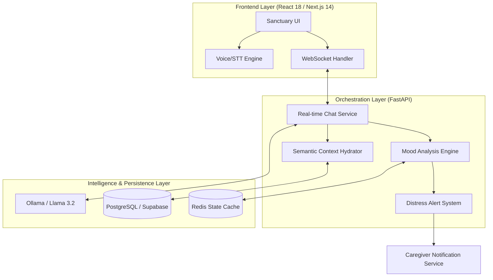

# <p align="center">  </p>

<p align="center">
  
  
  
</p>

---

## 🌟 Vision & Mission
**Clara** is an industrial-grade, empathetic AI companion engineered specifically for dementia care. Unlike traditional assistants, Clara focuses on **emotional validation** and **reminiscence therapy**, providing a sanctuary for patients and a robust oversight tool for caregivers.

> [!TIP]
> **Industrial Goal**: To bridge the gap between clinical care and emotional companionship using state-of-the-art LLMs and real-time biometric-aware interaction.

---

## 📸 Technical Showcase

### 1. The Sanctuary Interface
Designed for low cognitive load, the interface uses a Forest Green and Beige palette ("The Sanctuary Theme") to reduce anxiety and promote grounding.

<p align="center">
  
</p>

### 2. Caregiver Intelligence Dashboard
Providing real-time analytics on patient mood, cognitive trends, and automated distress alerting.

<p align="center">
  
</p>

---

## 🏗️ System Architecture

Clara is built on a resilient, multi-layered monorepo architecture designed for high availability and low latency.



---

## 🛠️ Integrated Tech Stack

| Layer | Technology | Security & Standards |
| :--- | :--- | :--- |
| **Frontend** | Next.js 14 (App Router), TailwindCSS | React 18 Concurrent Features |
| **Backend** | FastAPI (Python 3.12), Pydantic v2 | JWT-based Session Auth |
| **Inference** | Ollama (Llama 3.2:1b/8b) | Local-first Privacy Compliance |
| **Database** | PostgreSQL (Supabase), pgvector | Semantic Memory Retrieval |
| **Cache** | Redis Stack | High-frequency State Persist |
| **DevOps** | Docker Compose | Multi-container Orchestration |

---

## ✅ Project Milestone: Status Repo (April 2026)

The project has reached significant stability in its core engine. Current achievements include:

- [x] **Empathetic Persona Engineering**: Fine-tuned system prompts for dementia validation therapy.
- [x] **Real-time Mood Classification**: Hybrid pattern-matching and LLM-based mood detection.
- [x] **Persistent Semantic Memory**: Integration of vector storage for cross-session patient history retrieval.
- [x] **Multi-modal Interaction**: Seamless voice-to-text and text-to-speech integration.
- [x] **Caregiver Dashboard Foundation**: Automated distress detection and notification workflows.
- [x] **Sanctuary Design System**: Fully responsive, accessible UI themed for cognitive support.

---

## ⚡ Quick Start (Developer Setup)

### Prerequisites
- Docker & Docker Compose
- Ollama (running locally or via container)
- Python 3.12+ / Node.js 20+

### Installation
1. Clone the repository and initialize environment variables:
   ```bash
   cp infra/.env.example infra/.env
   # Update variables for Supabase and Ollama
   ```

2. Spin up the infrastructure:
   ```bash
   docker compose -f infra/docker-compose.yml up --build
   ```

3. Access the portal:
   - **User Interface**: `http://localhost:3000`
   - **API Registry**: `http://localhost:8000/docs`

---

## 🔒 Security & Privacy
Clara is designed with a **Privacy-First** approach. By utilizing local LLM inference (via Ollama), sensitive patient data remains within the managed environment, minimizing external exposure and ensuring compliance with healthcare data regulations.

---
<p align="center">
  <i>Developed for the next generation of empathetic elderly care.</i>
</p>
