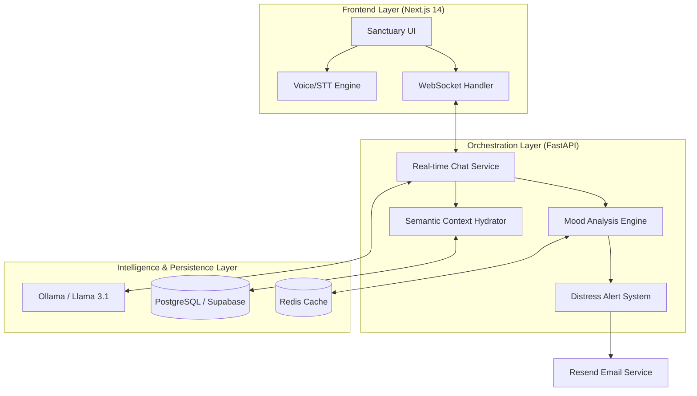

# <p align="center">  </p>

<p align="center">
  
  
  
</p>

---

## 🌟 Vision & Mission
**Clara** is an industrial-grade, empathetic AI companion engineered specifically for dementia care. Unlike traditional assistants, Clara focuses on **emotional validation** and **reminiscence therapy**, providing a sanctuary for patients and a robust oversight tool for caregivers.

---

## 🏗️ System Architecture

Clara is built on a resilient, multi-layered monorepo architecture designed for high availability and local-first AI processing.



---

## 🛠️ Prerequisites

Before you begin, ensure you have the following installed:
- **Python 3.10+** (Backend)
- **Node.js 18+ / npm** (Frontend)
- **Ollama** (Local AI Inference)
- **Git**

---

## ⚡ Quick Start (TL;DR)

```bash
git clone https://github.com/adityaagrawal777/T-42-Clara--Dementia-Assistant-
cd T-42-Clara--Dementia-Assistant-

# Backend
cd clara/backend
pip install -r requirements.txt

# Frontend
cd ../frontend
npm install

# Run Ollama
ollama run llama3.1:8b

# Start
uvicorn app.main:app --reload
npm run dev
```

---

## 🚀 Getting Started (Manual Setup)

Follow these steps to set up the project locally for development.

### 1. Clone the Repository
```bash
git clone https://github.com/adityaagrawal777/T-42-Clara--Dementia-Assistant-
cd T-42-Clara--Dementia-Assistant-
```

### 2. Configure Environment Variables
Copy the templates and fill in your service keys.

**Backend (`clara/backend/.env`):**
```env
DATABASE_URL=your_supabase_postgresql_url
REDIS_URL=your_redis_url
JWT_SECRET=your_generated_secret
RESEND_API_KEY=your_resend_api_key
OLLAMA_BASE_URL=http://localhost:11434
```

**Frontend (`clara/frontend/.env.local`):**
```env
NEXT_PUBLIC_API_URL=http://localhost:8000
NEXT_PUBLIC_WS_URL=ws://localhost:8000
```

### 3. Initialize AI Models
Clara requires two specific models to be pulled via Ollama:
```bash
ollama pull llama3.1:8b
ollama pull nomic-embed-text
```

### 4. Backend Setup
```bash
cd clara/backend
python -m venv .venv
# On Windows: .venv\Scripts\activate
# On Linux/macOS: source .venv/bin/activate
pip install -r requirements.txt
alembic upgrade head  # Run database migrations
```

### 5. Frontend Setup
```bash
cd ../frontend
npm install
```

---

## ⚡ Running the Application

### Development Mode (Recommended)
You can start both services using the provided batch scripts (Windows) or manual commands:

**Option A: Using Batch Scripts**
- Run `clara/backend/start_backend.bat`
- Run `clara/frontend/start_frontend.bat`

**Option B: Manual Commands**
- **Backend**: `uvicorn app.main:app --reload --port 8000` (within `.venv`)
- **Frontend**: `npm run dev`

### Docker Mode
For a containerized environment:
```bash
docker compose -f clara/infra/docker-compose.yml up --build
```

---

## ✅ Feature Roadmap
- [x] **Empathetic Persona Engineering**: Validation therapy-aligned prompts.
- [x] **Real-time Mood Classification**: Hybrid detection engine.
- [x] **Persistent Semantic Memory**: Cross-session patient history.
- [x] **Multi-modal Interaction**: STT/TTS voice integration.
- [x] **Caregiver Alerts**: Automated distress notifications via Resend.

---

## 🔒 Security & Privacy
Clara prioritizes patient privacy. By utilizing **local LLM inference** via Ollama, sensitive interactions remain within your controlled environment, ensuring higher data sovereignty than cloud-only solutions.

---

## 👥 Contributors
Aditya Agarwal (Backend)  
Aditya Sharma (Agent and ML)  
Kushagra Trivedi (Frontend)

---

<p align="center">
  <i>Developed for the next generation of empathetic elderly care.</i>
</p>
